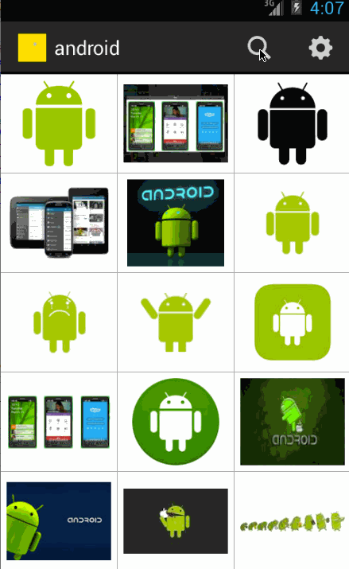

This is a simple app that searches for images using Google Image search API  and displays the images in a grid view. It demonstrates the use of grid view, progress indicator, actionbar searchview with autocomplete from history and the use of Android Intent and SharedPreferences. It uses the loopj async http client to asynchronously fetch data. It also uses SmartImageView from loopj to asynchronously download and display images.

Time spent: approx. 15 hours total

User stories completed:  
-User can enter a search query that will display a grid of image results from the Google Image API.  
-User can click on "settings" which allows selection of advanced search options to filter results  
-User can configure advanced search filters such as size, color, type and site  
-Subsequent searches will have any filters applied to the search results  
-User can tap on any image in results to see the image full-screen  
-User can scroll down “infinitely” to continue loading more image results (up to 8 pages)  

Additional user stories completed:  
-Search widget is embedded in the ActionBar  
-When the user starts typing search query, autocomplete suggestions are shown using previous queries performed by the user  
-ActionBar shows "Up" navigation button in settings and full image screens  
-Full image can be shared by any of the sharing apps present on the phone  
-Polished look and feel for results displayed in the grid view  
-Progress indicator is shown when results are being fetched from the network  
-Error handling in case of Internet failures   

Demo:  

