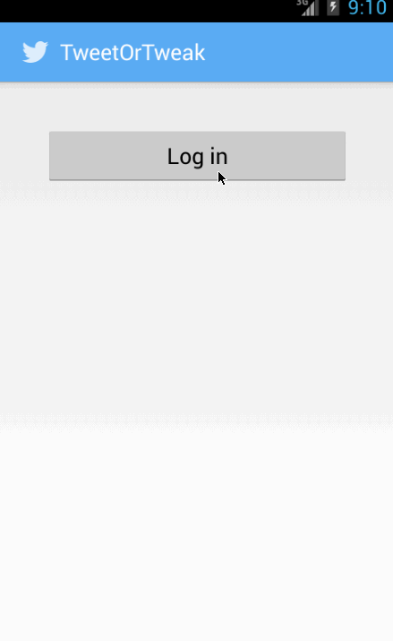

This is a simple Twitter client app that authenticates with Twitter using oauth and displays user's timeline. It also allows user to compose tweet and send it. The app draws its design and look and feel inspiration from official Twitter app. It uses Android async http library to fetch content from Twitter API and uses Universal Image Loader app to download and display images. 

Time spent: approx. 15 hours total  

User stories completed:  
-User can sign in to Twitter using OAuth login  
-User can view the tweets from their home timeline  
-User should be able to see the username, name, body and timestamp for each tweet  
-User should be displayed the relative timestamp for a tweet "8m", "7h"  
-User can view more tweets as they scroll with infinite pagination  
-User can compose a new tweet  
-User can click a “Compose” icon in the Action Bar on the top right  
-User can then enter a new tweet and post this to twitter  
-User is taken back to home timeline with new tweet visible in timeline  

Additional user stories / features completed:  
-Links in tweets are clickable and launches the web browser  
-User can see a counter with total number of characters left for tweet  
-User can refresh tweets timeline by pulling down to refresh  
-User can open the twitter app offline and see last loaded tweets  
-Official Twitter app branded  

Demo:  

